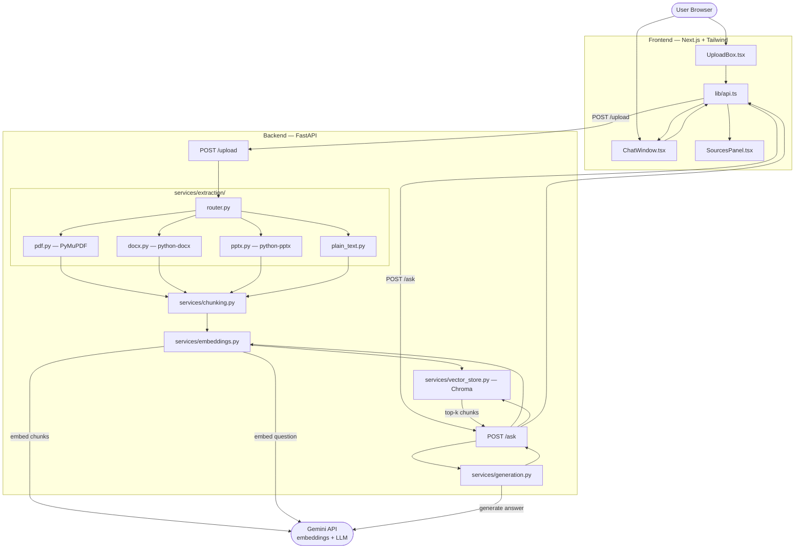

# Design Document: RAG Document Chatbot

## Overview

The RAG Document Chatbot is a full-stack local demo application that enables users to upload a single document and ask natural-language questions about its contents. Answers are generated exclusively from the uploaded document using a Retrieval-Augmented Generation (RAG) pipeline, with page or slide citations so users can verify every response.

The system is composed of two independent services:

- **Backend** — a FastAPI Python service that orchestrates the full RAG pipeline: file type detection, text extraction, chunking, embedding via the Gemini API, vector storage in Chroma, similarity retrieval, and answer generation.
- **Frontend** — a Next.js + Tailwind CSS application that provides a file upload interface, a chat window, and a collapsible sources panel.

The two services communicate over HTTP REST. The backend is stateless per request: each `/upload` and `/ask` call is self-contained. Conversation history is not persisted server-side in v1.

### Key Constraints

| Constraint | Value |
|---|---|
| Max file size | 50 MB |
| Max pages / slides | 300 |
| Chunk word limit | ≤ 500 words |
| Chunk overlap | 45–55 words |
| TOP_K_CHUNKS (default) | 5 (range 1–20, env-configurable) |
| Scanned-page threshold | < 50 extractable characters |
| Question length limit | 1–2000 characters |
| API timeout (frontend) | 30 seconds |

---

## Architecture

### System Context Diagram



### Ingestion Data Flow

```
POST /upload (multipart)
    │
    ├─ Validate: size ≤ 50 MB, pages ≤ 300
    │
    ├─ Detect file type (magic bytes → MIME fallback)
    │       └─ Unsupported → HTTP 415
    │       └─ Detection failure → HTTP 422
    │
    ├─ Route to extractor → List[TextSegment]
    │       └─ Extraction error → HTTP 500
    │
    ├─ Chunk segments → List[Chunk]
    │
    ├─ Atomically delete old chunks for Document_ID
    │
    ├─ Embed each Chunk (Gemini API)
    │       └─ API error → rollback + HTTP 502
    │
    ├─ Write each Chunk to Chroma
    │       └─ Write error → rollback + HTTP 500
    │
    └─ HTTP 200 { document_id, chunk_count }
```

### Query Data Flow

```
POST /ask { question, document_id }
    │
    ├─ Validate: question 1–2000 chars → else HTTP 422
    │
    ├─ Embed question (Gemini API)
    │       └─ API error → HTTP 502
    │
    ├─ Similarity search in Chroma (scoped to document_id, top-k)
    │       └─ No chunks found → "not found" answer + HTTP 200
    │
    ├─ Build grounded prompt
    │
    ├─ Call Gemini LLM
    │       └─ API error → HTTP 502
    │
    ├─ Build deduplicated Citations list
    │
    └─ HTTP 200 { answer, citations, chunks }
```

---

## Components and Interfaces

### Backend Components

#### `routes/upload.py` — Upload Route

Handles `POST /upload`. Orchestrates the full ingestion pipeline.

```python
async def upload_document(file: UploadFile) -> UploadResponse:
    """
    Validates, extracts, chunks, embeds, and stores an uploaded document.
    Returns UploadResponse on success; raises HTTPException on failure.
    """
```

**Responsibilities:**
- Read file bytes and validate size (≤ 50 MB); return HTTP 422 if exceeded
- Delegate type detection to `extraction/router.py`; return HTTP 415 / 422 as appropriate
- Generate a unique `document_id` (UUID4)
- Call extractor, chunker, embedder, vector store in sequence
- Handle rollback and error propagation

#### `routes/ask.py` — Ask Route

Handles `POST /ask`. Orchestrates the query pipeline.

```python
async def ask_question(request: AskRequest) -> AskResponse:
    """
    Embeds the question, retrieves relevant chunks, generates an answer,
    builds citations, and returns the full response.
    """
```

**Responsibilities:**
- Validate question (non-empty, ≤ 2000 chars); return HTTP 422 if invalid
- Embed question, retrieve top-k chunks, generate answer
- Build deduplicated citation list
- Handle API failures with HTTP 502

#### `services/extraction/router.py` — File Type Router

```python
def detect_and_route(file_bytes: bytes, filename: str, mime_type: str) -> List[TextSegment]:
    """
    Inspects magic bytes; falls back to MIME type for detection.
    Uses .md extension as tiebreaker when MIME is text/plain.
    Routes to the correct extractor.
    Raises UnsupportedTypeError (→ HTTP 415) or UnreadableFileError (→ HTTP 422).
    """
```

Magic byte signatures used for detection:

| Format | Magic Bytes (hex) |
|---|---|
| PDF | `25 50 44 46` (`%PDF`) |
| DOCX | `50 4B 03 04` (ZIP — validated by checking content-type.xml) |
| PPTX | `50 4B 03 04` (ZIP — validated by checking ppt/ entry) |
| TXT/MD | No magic bytes; relies on MIME `text/plain` + extension |

#### `services/extraction/pdf.py` — PDF Extractor

```python
def extract_pdf(file_bytes: bytes) -> List[TextSegment]:
    """
    Uses PyMuPDF (fitz) to extract text per page.
    Skips scanned pages (< 50 chars) with a warning log.
    Returns segments with 1-based page Location.
    """
```

#### `services/extraction/docx.py` — DOCX Extractor

```python
def extract_docx(file_bytes: bytes) -> List[TextSegment]:
    """
    Uses python-docx to extract text per paragraph.
    Location = ceil(paragraph_index / 10), where paragraph_index is 1-based.
    """
```

#### `services/extraction/pptx.py` — PPTX Extractor

```python
def extract_pptx(file_bytes: bytes) -> List[TextSegment]:
    """
    Uses python-pptx to extract text per slide.
    Location = 1-based slide number.
    """
```

#### `services/extraction/plain_text.py` — Plain Text Extractor

```python
def extract_plain_text(file_bytes: bytes) -> List[TextSegment]:
    """
    Decodes bytes as UTF-8 and returns a single TextSegment with no Location.
    """
```

#### `services/chunking.py` — Chunker

```python
def chunk_segments(
    segments: List[TextSegment],
    document_id: str,
    file_type: str,
) -> List[Chunk]:
    """
    Splits segments into overlapping chunks (≤ 500 words, 45–55 word overlap).
    Splits at paragraph boundaries; falls back to sentence boundary for oversized paragraphs.
    Attaches document_id, file_type, and location metadata to every chunk.
    Logs a warning for empty/whitespace segments and skips them.
    """
```

**Algorithm (pseudocode):**
```
for each segment in segments:
    if segment.text is empty/whitespace:
        log warning(document_id, segment_index)
        continue
    
    paragraphs = split_by_blank_lines(segment.text)
    buffer = []
    buffer_word_count = 0
    
    for each paragraph in paragraphs:
        para_words = word_count(paragraph)
        
        if para_words > 500:
            # Oversized paragraph: split at sentence boundary
            sentences = split_sentences(paragraph)
            for sentence in sentences:
                if buffer_word_count + word_count(sentence) > 500:
                    emit_chunk(buffer, segment.location)
                    # Retain overlap: last 45-55 words from buffer
                    buffer = get_overlap_words(buffer, target=50)
                    buffer_word_count = word_count(buffer)
                buffer.append(sentence)
                buffer_word_count += word_count(sentence)
        else:
            if buffer_word_count + para_words > 500:
                emit_chunk(buffer, segment.location)
                buffer = get_overlap_words(buffer, target=50)
                buffer_word_count = word_count(buffer)
            buffer.append(paragraph)
            buffer_word_count += para_words
    
    if buffer is not empty:
        emit_chunk(buffer, segment.location)
```

#### `services/embeddings.py` — Embedder

```python
def embed_texts(texts: List[str]) -> List[List[float]]:
    """
    Calls the Gemini embedding model once per text string.
    Reads GEMINI_API_KEY from environment.
    Raises GeminiAPIError on failure (→ HTTP 502).
    """

def embed_single(text: str) -> List[float]:
    """Convenience wrapper for a single text embedding."""
```

#### `services/vector_store.py` — Vector Store

```python
def replace_document_chunks(document_id: str, chunks: List[Chunk], embeddings: List[List[float]]) -> None:
    """
    Atomically replaces all existing chunks for document_id with the new chunks.
    Deletes old records first, then bulk-inserts new records.
    Raises VectorStoreError on write failure.
    """

def similarity_search(document_id: str, query_embedding: List[float], top_k: int) -> List[Chunk]:
    """
    Returns the top_k most similar chunks scoped to document_id.
    Returns an empty list if no chunks exist for the document_id.
    """

def rollback_document(document_id: str) -> None:
    """
    Deletes all chunks for document_id. Called on ingestion failure.
    Best-effort: logs errors but does not raise.
    """
```

**Atomic replacement strategy:**

Chroma does not provide multi-statement transactions. We approximate atomicity:
1. Generate all embeddings first (outside the store)
2. Delete all existing records for `document_id` using `collection.delete(where={"document_id": document_id})`
3. Bulk-insert all new records in a single `collection.add()` call

Any query running concurrently with step 2–3 will see either the old full set or the new full set because the delete and add happen in rapid succession within a single Python async context. A true ACID transaction is not needed for this local demo scope.

#### `services/generation.py` — Generator

```python
def build_prompt(question: str, chunks: List[Chunk]) -> str:
    """
    Constructs a grounded prompt instructing the LLM to answer only from
    the supplied context and to use the fixed "not found" phrase when the
    answer is absent.
    """

def generate_answer(question: str, chunks: List[Chunk]) -> str:
    """
    Calls the Gemini LLM with the constructed prompt.
    Returns the answer text.
    Raises GeminiAPIError on failure.
    """
```

**Prompt template:**

```
You are a document Q&A assistant. Answer the user's question using ONLY
the context passages provided below. Do not use any external knowledge.

If the answer cannot be found in the provided context, respond with exactly:
"The answer was not found in the uploaded document."

Context:
---
{chunk_1_text}
---
{chunk_2_text}
---
...

Question: {question}

Answer:
```

### Frontend Components

#### `components/UploadBox.tsx`

Manages file selection, validation, and the upload request. Displays persistent inline error messages adjacent to the upload zone. Accepts `.pdf`, `.docx`, `.pptx`, `.txt`, `.md`.

**State:**
- `file: File | null` — currently selected file
- `uploading: boolean` — request in flight
- `error: string | null` — persistent error message
- `documentId: string | null` — emitted upward on success

**Key behaviour:**
- On success: calls `onUploadSuccess(documentId)` callback; clears error
- On failure / timeout (30 s): sets `error`; does not retry automatically
- On new upload attempt: clears previous error

#### `components/ChatWindow.tsx`

Renders the conversation history and the question input. Disabled while no document is ingested.

**State:**
- `messages: Message[]` — array of `{ role, text, citations?, chunks? }`
- `question: string` — current input value
- `loading: boolean` — request in flight
- `error: string | null` — inline error below chat

**Key behaviour:**
- Submit button and input disabled when `documentId` is null
- Displays label "Upload a document to start chatting" when no document
- On answer received: appends message with citations rendered inline
- Citations displayed immediately below answer text

#### `components/SourcesPanel.tsx`

Collapsible panel showing retrieved source chunks for the last answer.

**Props:**
- `chunks: SourceChunk[]`
- `defaultCollapsed: true`

Renders each chunk with: rank label ("Source 1", …), citation label ("Page N" / "Slide N", omitted for TXT/MD), full chunk text.

#### `lib/api.ts`

Typed wrappers around the backend endpoints.

```typescript
const API_BASE = process.env.NEXT_PUBLIC_API_URL ?? "http://localhost:8000";

export async function uploadDocument(file: File): Promise<UploadResponse>
export async function askQuestion(question: string, documentId: string): Promise<AskResponse>
```

Both functions use a 30-second `AbortController` timeout and throw `ApiError` (with a user-friendly message) on any non-2xx response or network failure.

---

## Data Models

### Backend Pydantic Schemas (`models/schemas.py`)

```python
from pydantic import BaseModel, Field
from typing import Optional, List
from enum import Enum

class FileType(str, Enum):
    PDF = "pdf"
    DOCX = "docx"
    PPTX = "pptx"
    TXT = "txt"
    MD = "md"

class TextSegment(BaseModel):
    """Raw text unit produced by an extractor."""
    text: str
    location: Optional[int] = None   # 1-based page/slide; absent for TXT/MD

class Chunk(BaseModel):
    """A processed, embeddable unit of text with full provenance metadata."""
    chunk_id: str                    # UUID4, assigned at chunking time
    document_id: str
    file_type: FileType
    text: str
    location: Optional[int] = None  # absent (not null) for TXT/MD

class Citation(BaseModel):
    """A deduplicated source reference for display in the frontend."""
    label: str                       # "Page N" or "Slide N"
    location: int

# ── Request / Response models ──────────────────────────────────────────────

class UploadResponse(BaseModel):
    document_id: str
    chunk_count: int

class AskRequest(BaseModel):
    question: str = Field(..., min_length=1, max_length=2000)
    document_id: str

class SourceChunk(BaseModel):
    """A retrieved chunk returned to the frontend."""
    rank: int                        # 1-based retrieval rank
    text: str
    citation: Optional[Citation] = None

class AskResponse(BaseModel):
    answer: str
    citations: List[Citation]        # deduplicated, ordered by location
    chunks: List[SourceChunk]
```

### Frontend TypeScript Types (`lib/api.ts`)

```typescript
export interface UploadResponse {
  document_id: string;
  chunk_count: number;
}

export interface Citation {
  label: string;   // "Page N" or "Slide N"
  location: number;
}

export interface SourceChunk {
  rank: number;
  text: string;
  citation?: Citation;
}

export interface AskResponse {
  answer: string;
  citations: Citation[];
  chunks: SourceChunk[];
}

export interface Message {
  role: "user" | "assistant";
  text: string;
  citations?: Citation[];
  chunks?: SourceChunk[];
}
```

### Chroma Collection Schema

Each Chroma record maps to one `Chunk`. Chroma's `add()` API accepts four parallel arrays:

| Chroma field | Type | Content |
|---|---|---|
| `ids` | `List[str]` | `chunk_id` |
| `embeddings` | `List[List[float]]` | Gemini embedding vector |
| `documents` | `List[str]` | `chunk.text` |
| `metadatas` | `List[dict]` | `{ document_id, file_type, location? }` |

`location` is included in the metadata dict only when present (TXT/MD chunks omit the key entirely).

### Environment Variables

**Backend (`.env.example`):**
```
# Required — obtain from https://aistudio.google.com/apikey
GEMINI_API_KEY=your_gemini_api_key_here

# Optional — integer 1–20, default 5
TOP_K_CHUNKS=5
```

**Frontend (`.env.local.example`):**
```
# URL of the running FastAPI backend
NEXT_PUBLIC_API_URL=http://localhost:8000
```

---

## Correctness Properties

*A property is a characteristic or behavior that should hold true across all valid executions of a system — essentially, a formal statement about what the system should do. Properties serve as the bridge between human-readable specifications and machine-verifiable correctness guarantees.*


### Property 1: Document_ID Uniqueness

*For any* two independent upload requests with valid files, the two returned Document_IDs must be distinct non-empty strings.

**Validates: Requirements 1.3**

---

### Property 2: File Size and Page Limit Rejection

*For any* file that exceeds 50 MB or contains more than 300 pages/slides, the backend must return HTTP 422 with a message identifying which limit was exceeded.

**Validates: Requirements 1.5**

---

### Property 3: Successful Upload Clears Prior State

*For any* prior frontend state (existing document ID, non-empty conversation history), a subsequent successful upload must replace the document ID with the new one and reset the conversation history to empty.

**Validates: Requirements 1.7**

---

### Property 4: Magic-Bytes-First Type Detection

*For any* file where the magic bytes indicate format X and the file extension or MIME type suggests a different format Y, the backend must route the file to format X's extractor (not Y's), never using extension alone.

**Validates: Requirements 2.1**

---

### Property 5: Unsupported Type Returns HTTP 415

*For any* file whose magic bytes and MIME type do not match any supported format (PDF, DOCX, PPTX, TXT/MD), the backend must return HTTP 415 with a message naming the detected type and listing the accepted types, without attempting extraction.

**Validates: Requirements 2.6**

---

### Property 6: PDF Extraction Produces Correct 1-Based Page Locations

*For any* PDF with N text-extractable pages (pages with ≥ 50 characters), the extractor must produce exactly N segments, and each segment's location must equal its 1-based page number in the document.

**Validates: Requirements 3.1**

---

### Property 7: DOCX Extraction Applies the ceil(paragraph_index / 10) Location Formula

*For any* DOCX with N paragraphs, each extracted segment's location must equal ⌈paragraph_index / 10⌉ where paragraph_index is the 1-based ordinal of the paragraph.

**Validates: Requirements 3.3**

---

### Property 8: PPTX Extraction Produces Correct 1-Based Slide Locations

*For any* PPTX with N slides, each extracted segment's location must equal the 1-based slide number of the slide from which it was extracted.

**Validates: Requirements 3.4**

---

### Property 9: TXT/MD Extraction Produces a Single Segment with No Location

*For any* TXT or MD file content, plain-text extraction must produce exactly one segment, and that segment must have no location field (the field must be absent, not null or zero).

**Validates: Requirements 3.5, 10.1**

---

### Property 10: Chunk Word Limit and Overlap Invariant

*For any* text segment of arbitrary word count and content, every chunk produced by the chunker must satisfy two invariants simultaneously: (a) word_count(chunk.text) ≤ 500, and (b) for every consecutive pair of chunks derived from the same segment, the shared word overlap is between 45 and 55 words inclusive.

**Validates: Requirements 4.1, 4.2**

*Note: Properties for 4.1 and 4.2 are combined here because they are both invariants over the same chunking output and testing them together with a single generator is more comprehensive than testing separately.*

---

### Property 11: Chunker Attaches Complete Metadata to Every Chunk

*For any* list of text segments with associated document_id and file_type, every chunk produced must carry document_id and file_type fields identical to the input values, and must carry the location from its source segment (or have location absent when the source segment has no location).

**Validates: Requirements 4.5, 5.3, 10.1**

*Note: This consolidates the metadata attachment properties from requirements 4.5, 5.3, and 10.1 — they all assert the same invariant: metadata supplied at ingestion must flow through to every chunk record.*

---

### Property 12: Embedder Is Called Exactly Once per Chunk

*For any* list of N chunks passed to the embedder, the Gemini embedding API must be called exactly N times — one call per chunk, no more, no less.

**Validates: Requirements 5.1**

---

### Property 13: Chunk Metadata Round-Trip Fidelity

*For any* chunk with arbitrary document_id, file_type, text, and optional location, storing the chunk in the vector store and then retrieving it must produce a record whose document_id, file_type, text, and location (or absence thereof) are identical to the values supplied at ingestion time. A TXT or MD chunk must have no location key in the retrieved record.

**Validates: Requirements 5.3, 10.1**

*Note: Property 11 covers the chunker side of metadata preservation; Property 13 covers the storage/retrieval side. Together they form a full pipeline round-trip guarantee.*

---

### Property 14: Atomic Replacement — Post-Ingestion Query Reflects Only New Chunks

*For any* document_id with an existing set of chunks, after a second ingestion with the same document_id completes successfully, every chunk returned by a similarity search for that document_id must belong to the new ingestion (none from the old set).

**Validates: Requirements 5.4**

---

### Property 15: Successful Ingestion Response Matches Actual Stored Count

*For any* valid document, when ingestion completes without error, the HTTP 200 response must include the correct document_id and a chunk_count equal to the number of chunks actually inserted into the vector store.

**Validates: Requirements 5.6**

---

### Property 16: Retrieval Is Scoped to the Queried Document_ID

*For any* similarity search against any document_id, every chunk in the result set must carry a document_id equal to the queried document_id. Cross-document results must never appear.

**Validates: Requirements 6.4, 10.2**

*Note: Requirements 6.4 and 10.2 express the same scoping invariant from two different perspectives (query side and retrieval-result side). They are combined into one property.*

---

### Property 17: Grounded Prompt Always Contains the Anti-Hallucination Instruction

*For any* question string and any list of retrieved chunks, the prompt constructed by the generator must contain both the instruction to answer only from the provided context and the exact "not found" fallback phrase.

**Validates: Requirements 6.5**

---

### Property 18: Invalid Question Length Returns HTTP 422 Without AI Calls

*For any* question string whose length is 0 characters or greater than 2000 characters, the backend must return HTTP 422 and must not invoke the Gemini embedding or LLM APIs.

**Validates: Requirements 6.9**

---

### Property 19: Citations Are Deduplicated by Location and Correctly Formatted

*For any* list of retrieved chunks with location metadata, the citation list built by the backend must contain at most one entry per unique location value, each entry formatted as "Page N" for PDF/DOCX sources and "Slide N" for PPTX sources, where N is the location integer.

**Validates: Requirements 7.1**

---

### Property 20: Source Chunk Rendering Includes All Available Elements

*For any* retrieved chunk (with or without a citation), the SourcesPanel must render the chunk's rank label and full text; the citation label must be included when the chunk has a location and omitted (no placeholder) when it does not.

**Validates: Requirements 7.3, 7.4**

*Note: 7.4 is the no-location edge case of 7.3. Combining into one property tests both the presence path and the absence path with a single generator.*

---

### Property 21: Inline Errors Appear in the Correct Zone and Persist

*For any* 4xx or 5xx response from either the upload or ask endpoint, the frontend must display a non-technical persistent inline error message in the UI zone corresponding to the triggering action (upload zone or chat area), and the error must remain until a new successful action in that zone clears it.

**Validates: Requirements 8.1, 8.3**

*Note: 8.3 (successful action clears error) is the inverse of 8.1 (error appears on failure). Testing both together as a round-trip: error appears → success → error gone.*

---

### Property 22: Controls Remain Enabled During Error State

*For any* error state (whether triggered by upload failure or question failure), the file input, upload submit control, and question submit control must all be enabled (not disabled), allowing the user to retry without reloading.

**Validates: Requirements 8.5**

---

### Property 23: TOP_K_CHUNKS Defaults to 5 for Any Invalid Configuration

*For any* value of the TOP_K_CHUNKS environment variable that is absent, non-numeric, or outside the inclusive range [1, 20], the system must use exactly 5 as the number of chunks to retrieve per query.

**Validates: Requirements 9.2**

---

### Property 24: Chunker Idempotence

*For any* valid text segment list with the same document_id, file_type, and chunking configuration, running the chunker twice must produce chunk lists whose text content and metadata fields are identical in both runs (same chunk count, same texts, same metadata values, same order).

**Validates: Requirements 10.3**

---

## Error Handling

### Error Classification

| Source | Condition | HTTP Status | Response Body |
|---|---|---|---|
| Upload route | Unsupported file type (detected) | 415 | `{ error: "Unsupported type '{type}'. Accepted: pdf, docx, pptx, txt, md" }` |
| Upload route | Corrupt / unreadable header | 422 | `{ error: "File could not be read: unreadable header" }` |
| Upload route | File > 50 MB | 422 | `{ error: "File exceeds the 50 MB size limit" }` |
| Upload route | Document > 300 pages/slides | 422 | `{ error: "Document exceeds the 300 page/slide limit" }` |
| Extractor | Unhandled exception | 500 | `{ error: "Extraction failed for '{filename}': {ExceptionType}" }` |
| Embedder | Gemini API error (ingestion) | 502 | `{ error: "Embedding failed at chunk index {i}: {api_reason}" }` |
| Vector store | Write error | 500 | `{ error: "Storage failure: {message}" }` |
| Ask route | Empty or oversized question | 422 | `{ error: "Question must be between 1 and 2000 characters" }` |
| Ask route | Gemini API error (query embed or LLM) | 502 | `{ error: "{embed/generation} API call failed: {api_reason}" }` |
| Startup | `GEMINI_API_KEY` absent | — | App refuses to start; logs `CRITICAL: GEMINI_API_KEY is not set` |

### Rollback Strategy

When embedding or storage fails mid-ingestion:

1. The route handler calls `vector_store.rollback_document(document_id)` to delete any partially-written chunks.
2. `rollback_document` is best-effort: it catches and logs any Chroma errors internally and does not re-raise.
3. The route handler always returns the appropriate HTTP error (502 for embedding failure, 500 for storage failure) regardless of whether the rollback succeeded.

### Frontend Error Display Rules

- All errors are shown as persistent inline messages inside the relevant UI zone.
- No toast notifications of any kind are used.
- Upload errors appear inside the `UploadBox` component.
- Ask/answer errors appear inside the `ChatWindow` component below the message list.
- Error text is user-friendly: it describes what happened and what the user can do (e.g., "Upload failed — the file type is not supported. Please upload a PDF, DOCX, PPTX, TXT, or Markdown file.").
- Internal HTTP status codes and stack traces are never surfaced to the user.
- A 30-second frontend timeout triggers the message: "Request timed out. Please try again."

---

## Testing Strategy

### Dual Testing Approach

The testing strategy uses two complementary layers:

1. **Property-based tests** verify universal correctness properties across a wide range of generated inputs. Each property from the Correctness Properties section above maps to exactly one property-based test.
2. **Unit/example-based tests** verify specific scenarios, edge cases, and error conditions that are best described with concrete examples.

### Property-Based Testing

**Library:** [Hypothesis](https://hypothesis.readthedocs.io/) (Python) for backend properties; [@fast-check/jest](https://github.com/dubzzz/fast-check) or [fast-check](https://github.com/dubzzz/fast-check) for frontend TypeScript properties.

**Minimum iterations:** 100 per property test (Hypothesis default is 100; configure `@settings(max_examples=100)` explicitly).

**Tag format for traceability:**

```python
# Feature: rag-document-chatbot, Property 10: Chunk word limit and overlap invariant
@given(st.text(min_size=1, max_size=10000))
@settings(max_examples=100)
def test_chunk_word_limit_and_overlap(text):
    ...
```

**Backend property tests (Hypothesis):**

| Property | Test file | Generators |
|---|---|---|
| P1 — Document_ID uniqueness | `tests/test_upload.py` | `st.binary()` (valid file bytes) |
| P2 — Size/page rejection | `tests/test_upload.py` | Files with byte count > 50 MB or page count > 300 |
| P3 — Upload clears prior state | `tests/test_frontend.py` | Prior state objects |
| P4 — Magic-bytes-first detection | `tests/test_extraction_router.py` | Files with mismatched extension/content |
| P5 — Unsupported type → 415 | `tests/test_extraction_router.py` | Random byte sequences with no matching magic |
| P6 — PDF page locations | `tests/test_pdf_extractor.py` | Synthetic multi-page PDF bytes |
| P7 — DOCX paragraph locations | `tests/test_docx_extractor.py` | Synthetic DOCX with N paragraphs |
| P8 — PPTX slide locations | `tests/test_pptx_extractor.py` | Synthetic PPTX with N slides |
| P9 — TXT/MD no location | `tests/test_plain_text_extractor.py` | `st.text()` |
| P10 — Chunk word limit + overlap | `tests/test_chunking.py` | `st.text(min_size=50)` |
| P11 — Chunk metadata attachment | `tests/test_chunking.py` | Segments with varying metadata |
| P12 — Embedder call count | `tests/test_embeddings.py` | `st.lists(st.text(), min_size=1)` |
| P13 — Metadata round-trip fidelity | `tests/test_vector_store.py` | Chunk objects with varied metadata |
| P14 — Atomic replacement | `tests/test_vector_store.py` | Two successive chunk sets per document_id |
| P15 — Successful ingestion chunk_count | `tests/test_upload.py` | Valid documents of varying length |
| P16 — Retrieval scoped to document_id | `tests/test_vector_store.py` | Multiple document_ids stored simultaneously |
| P17 — Grounded prompt contains instruction | `tests/test_generation.py` | `st.text()` × `st.lists(chunks)` |
| P18 — Invalid question → 422, no AI calls | `tests/test_ask.py` | `st.text(max_size=0)` ∪ `st.text(min_size=2001)` |
| P19 — Citation deduplication + format | `tests/test_ask.py` | Lists of chunks with varied locations/file_types |
| P20 — Source chunk rendering | `tests/test_sources_panel.tsx` | SourceChunk objects with/without citations |
| P21 — Inline errors in correct zone | `tests/test_frontend.tsx` | Error responses from both endpoints |
| P22 — Controls enabled during errors | `tests/test_frontend.tsx` | Error states from both upload and ask |
| P23 — TOP_K_CHUNKS default fallback | `tests/test_config.py` | Invalid env values |
| P24 — Chunker idempotence | `tests/test_chunking.py` | Any valid segment list |

### Unit / Example-Based Tests

These cover specific scenarios and edge cases that are not universally variable:

**Backend:**
- File type detection: one representative test per supported type (PDF, DOCX, PPTX, TXT, MD)
- Scanned page skipping: PDF with a near-empty page and a normal page
- Short segment → single chunk (< 500 words)
- Empty/whitespace segment → warning logged, no chunk emitted
- Gemini API error mid-ingestion → rollback + HTTP 502, correct error body
- Vector store write error → rollback + HTTP 500
- No chunks found for document_id → "not found" answer + HTTP 200
- LLM returns "not found" phrase → answer field is the fixed phrase
- GEMINI_API_KEY absent at startup → server fails to start
- Corrupt file header → HTTP 422
- Unsupported type that also exceeds 50 MB → HTTP 415 (type checked first)

**Frontend:**
- UploadBox accept attribute contains all five extensions
- Question input/submit disabled before document upload with visible label
- Sources panel collapsed by default
- No toast notification rendered on error
- NEXT_PUBLIC_API_URL absent → fallback to `http://localhost:8000`
- Citations rendered immediately below answer text in message bubble

### Integration Tests

These verify that the full request-response pipeline works end-to-end with real (or mocked at the network boundary) Gemini API responses:

- Upload a real PDF → receive document_id and chunk_count; query a question → receive a non-empty answer with page citations
- Upload a PPTX → citations use "Slide N" format
- Upload a TXT file → answer has no citation labels
- Re-upload to the same session → prior conversation is cleared

### Test Infrastructure

- **Backend tests:** `pytest` + `pytest-asyncio` + `httpx` (ASGI test client) + `hypothesis`
- **Frontend tests:** `jest` + `@testing-library/react` + `fast-check`
- **Environment:** Tests use a separate `.env.test` that sets `GEMINI_API_KEY=test-key` and `TOP_K_CHUNKS=5`; actual Gemini API calls are mocked at the `httpx` / `google-generativeai` level in unit and property tests
- **CI:** All property and unit tests must pass before merge; integration tests run on demand against a live Gemini API key
